<picture>
  <source media="(prefers-color-scheme: dark)" srcset="assets/header-dark.svg">
  
</picture>

At **nPLAN** I build demand forecasts for S&OP (sales and operations planning), plus the software around them: Python pipelines, C#/.NET and PostgreSQL services, and the React screens where planners use the numbers. The forecast I develop is **+10 pp more accurate** than the one already used by multiple clients, and model runs dropped from **8h to 2h**.

<picture>
  <source media="(prefers-color-scheme: dark)" srcset="assets/models-dark.svg">
  
</picture>

On the side: [Quanto custa o mercado](https://quanto-custa-o-mercado.vercel.app), supermarket prices from iFood across Brazil's 27 state capitals.

### Certifications

 &nbsp;**[Claude Certified Developer](https://www.credly.com/badges/ed806f2a-da35-485d-a8e0-d5d228b6968c/public_url)**, Anthropic, 2026

 &nbsp;**[Data Science Specialization](https://theylor.dev/#education)**, Johns Hopkins University, 2026

### Tools

**Forecasting** &nbsp;`StatsForecast` `MLForecast` `NeuralForecast` `statsmodels` `Chronos` `TimesFM` `GluonTS` 
**Machine learning** &nbsp;`PyTorch` `scikit-learn` `LightGBM` `XGBoost` `Ray Tune` `CUDA` 
**Data and BI** &nbsp;`Python` `pandas` `NumPy` `PostgreSQL` `Power BI` `Apache Superset` 
**Software** &nbsp;`C# / .NET` `React` `TypeScript`

[theylor.dev](https://theylor.dev) · [contato@theylor.dev](mailto:contato@theylor.dev) · [LinkedIn](https://www.linkedin.com/in/theylor921/)
