<picture>
  <source media="(prefers-color-scheme: dark)" srcset="assets/header-dark.svg">
  
</picture>

The chart is my job in one picture. First the history. Then a backtest, where the model forecasts weeks it never saw and the dashed line is compared with what happened. Only after that comes the forecast, with its uncertainty.

At nPLAN I build demand forecasts that planning teams use in S&OP, and the software around them: the Python pipelines, the C#/.NET and PostgreSQL services, and the React screens where planners read the numbers.

- **+10 pp** accuracy over the forecast that several clients were already using
- **8h → 2h** model processing time, with GPU/CUDA, batching and caching
- **20+** forecasting models built and backtested: statistical, gradient boosting, deep learning, foundation models, ensembles

### How I check a forecast

1. Backtest the way the model will meet the future: holdout, expanding and sliding windows.
2. Choose the model per series. No single model wins on every series.
3. Use an external signal only if it was available on the forecast date. Anything else is leakage.
4. Look at bias and intervals, not just the error number.

### Outside work

**[Quanto custa o mercado](https://quanto-custa-o-mercado.vercel.app)** collects public supermarket prices from iFood in the 27 Brazilian state capitals: 161k clean prices from 1,179 stores, compared item by item between states and chains. ([code](https://github.com/theylor999/quanto-custa-o-mercado))

**Multiple** is a Windows app in C#/.NET that shares one mouse, keyboard, clipboard and audio across computers on the same network, over UDP/TCP.

### Before nPLAN

Data scientist at Odds Notifier (Norway, remote), where I used ML and LLMs to classify and prioritize customer-support messages. I'm studying Data Science at UNINTER and completed the Johns Hopkins Data Science Specialization.

`Python` `C# / .NET` `EF Core` `PostgreSQL` `React` `TypeScript` `GPU / CUDA`

[theylor.dev](https://theylor.dev) · [contato@theylor.dev](mailto:contato@theylor.dev) · [LinkedIn](https://www.linkedin.com/in/theylor921/)
